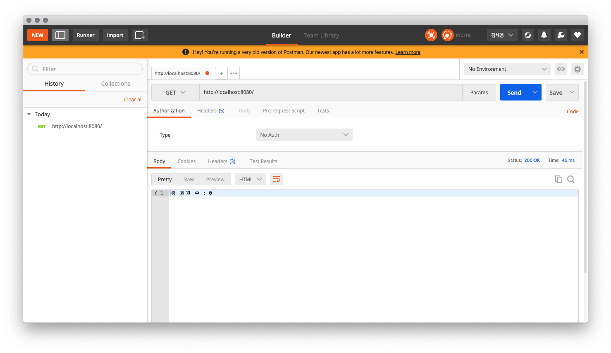
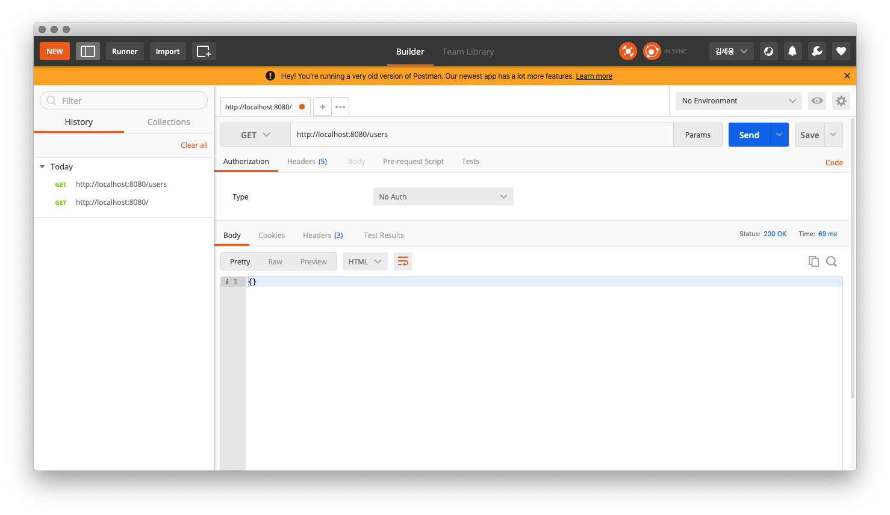
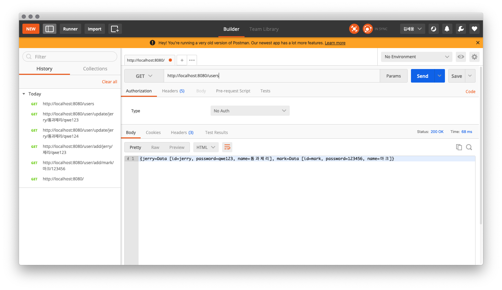

# REST API 예제

REST 개념을 공부하기 위해서, Spring STS를 이용하여 RESTful API를 구현한 프로젝트다.

1. RESTful API를 제공하기 위한 프레임워크 선택하기 *V (~2019/10/01)
2. RESTful 서비스 구축 *V (~2019/10/18) *화면단 구성이 없음.
3. 배포하기 Jenkins 설치해보기, docker 컨테이너를 활용해서 레이어 나눠보기
4. RESTful 서비스 확장하기 (API 게이트웨이 학습)
5. nginx 붙여보기(프록시 서버 개념 익히기)
6. 컨테이너 관리하기( 쿠버네티스 학습, elk(엘라스틱서치,로그스태시,키바나)로 분산 환경 모니터링 학습 )

궁금사항
1. Spring 에서 제공하는 RequestMapping 을 통해서 RESTful API를 구현하는 것이 올바른 것인지?

사용법
1. Project > Run
2. http://localhost:8080 (port 변동있을 수 있음)
3. http://localhost:8080/ (총 회원 수)  
   http://localhost:8080/users (모든 회원 정보) // get, post  
   http://localhost:8080/user/{id} (사용자 아이디에 맞는 회원 정보조회) // get, post  
   http://localhost:8080/user/add/{id}/{name}/{password} (회원 정보 추가) // get, post  
   http://localhost:8080/user/update/{id}/{name}/{password} (회원 정보 수정) // get, post  
   http://localhost:8080/user/delete/{id} (회원 정보 삭제) // get

   

.png)
.png)
_failed.png)
_success.png)

.png)
.png)
