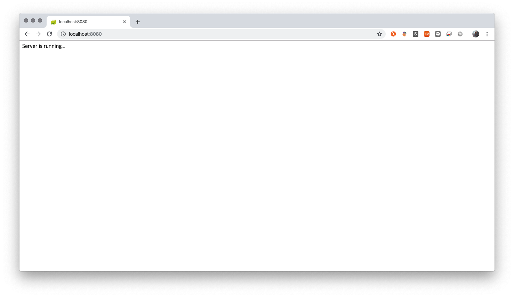
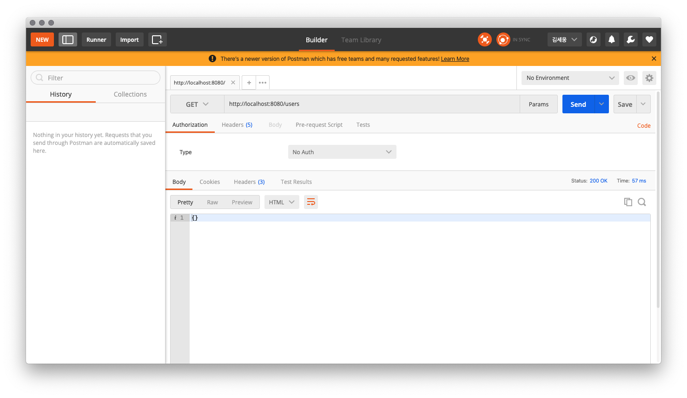
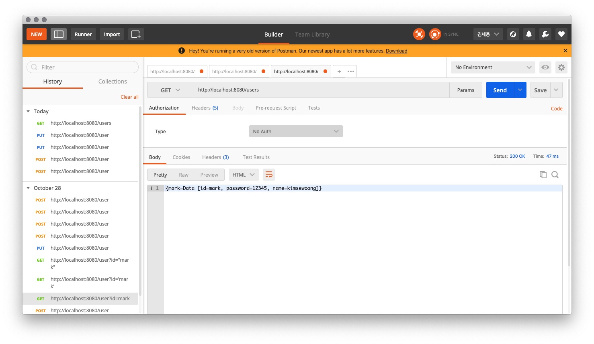
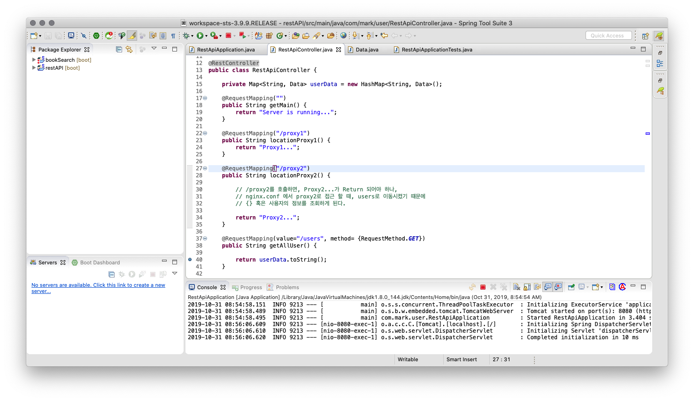
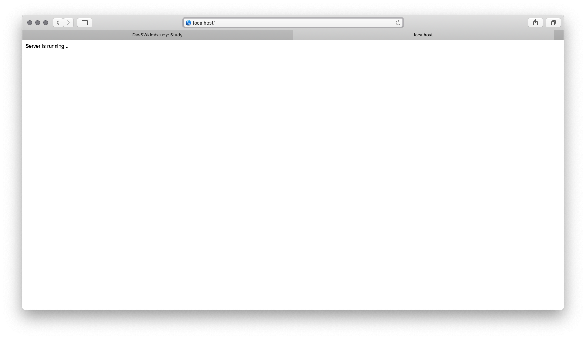
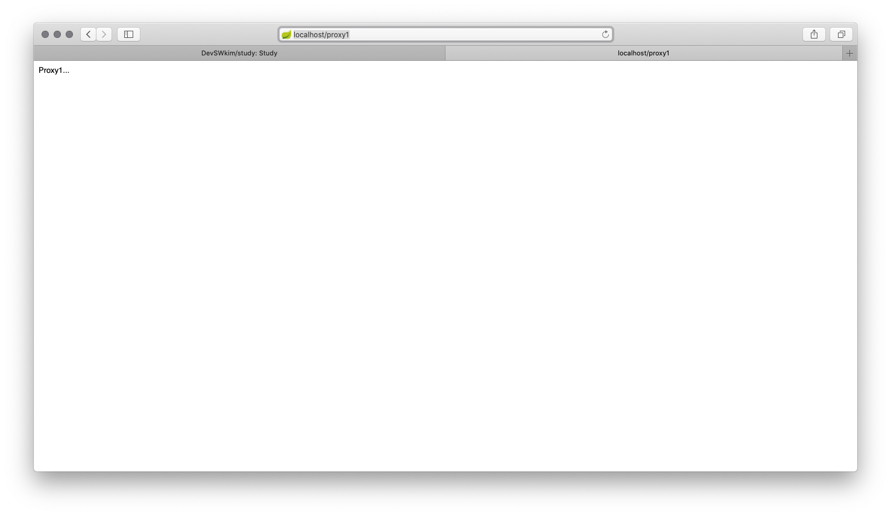
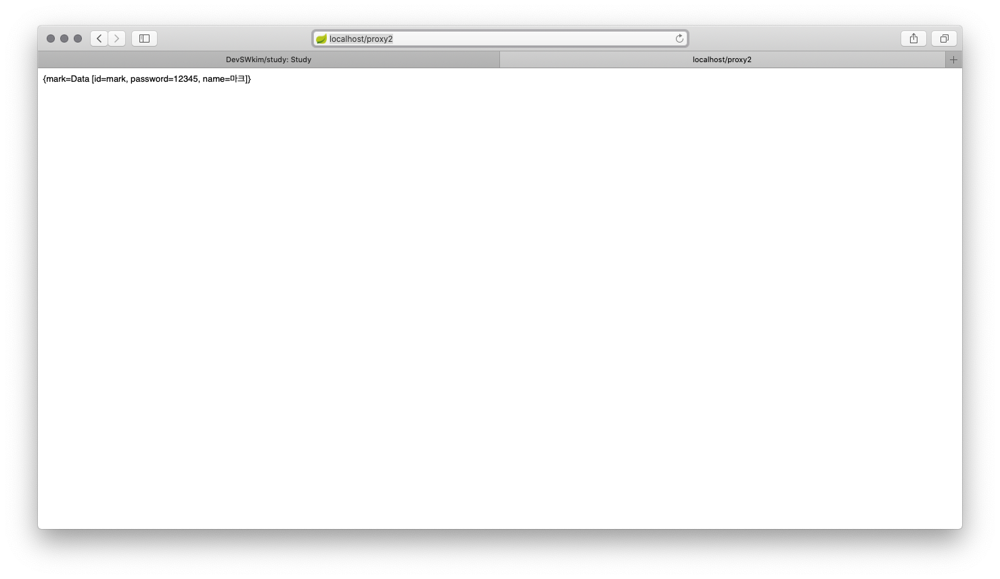
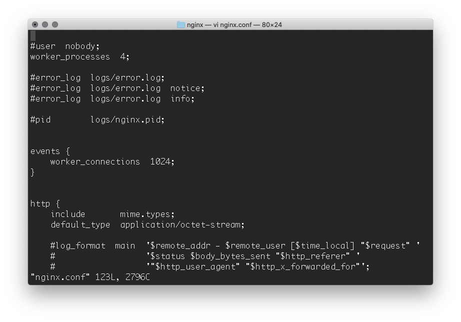
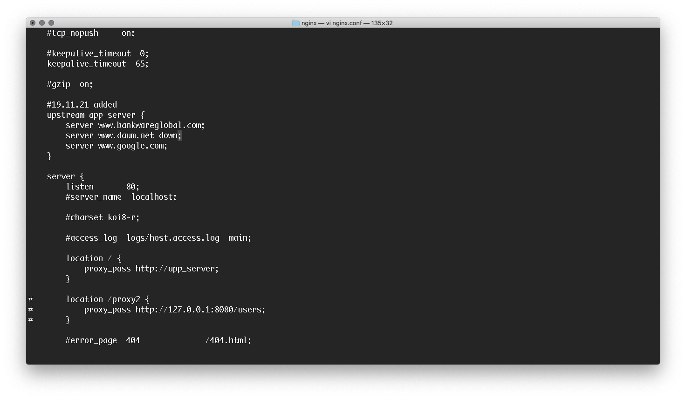

# REST API 예제

REST 개념을 공부하기 위해서, Spring STS를 이용하여 RESTful API를 구현한 프로젝트다.

1. RESTful API를 제공하기 위한 프레임워크 선택하기 *V (~2019/10/01)
2. RESTful 서비스 구축 *V (~2019/10/18) *화면단 구성이 없음.
3. 배포하기 Jenkins 설치해보기, docker 컨테이너를 활용해서 레이어 나눠보기
4. RESTful 서비스 확장하기 (API 게이트웨이 학습)
5. nginx 붙여보기(프록시 서버 개념 익히기)
6. 컨테이너 관리하기( 쿠버네티스 학습, elk(엘라스틱서치,로그스태시,키바나)로 분산 환경 모니터링 학습 )

궁금사항
1. Spring 에서 제공하는 RequestMapping 을 통해서 RESTful API를 구현하는 것이 올바른 것인지?

사용법
1. Project > Run
2. http://localhost:8080 (port 변동있을 수 있음)
3. http://localhost:8080 (health check)  
   http://localhost:8080/users (모든 회원 정보) // get  
   http://localhost:8080/user/{id} (사용자 아이디에 맞는 회원 정보조회) // get  
   http://localhost:8080/user/ (회원 정보 추가) // post  
   http://localhost:8080/user/ (회원 정보 수정) // put  
   http://localhost:8080/user/ (회원 정보 삭제) // delete

http://localhost:8080 (helath check)
   

http://localhost:8080/users (모든 회원 정보)

http://localhost:8080/user (사용자 정보 추가_POST)
.png)
.png)

http://localhost:8080/user (사용자 정보 수정_PUT_실패)
_failed.png)

http://localhost:8080/user (사용자 정보 수정_PUT_성공)
_success.png)

http://localhost:8080/user (사용자 정보 삭제_DELETE)
.png)

http://localhost:8080/user (일부 사용자 정보 삭제 후 재 조회)

Nginx 연습
----------

nginx configure 수정
- location / 부분에서 80으로 들어오는 모든 요청을 8080으로 변경하므로, 각각의 요청에 따른 proxy_pass는 의미가 없어진다.

.png)

경로 맵핑 소스

확인 1 (localhost:8080 -> localhost)

확인 2 (localhost/proxy1)

확인 3 (localhost/proxy2)
 

Nginx 스터디 추가부분
-----------

- nginx는 기본적으로 1개의 work process 를 띄우는데 config 파일을 통해 여러개의 work process 를 띄울 수 있다.
- work process 가 기본적으로 work_connection이 1024로설정 되어있으며, 1024 * 4 (수정한 nginx의 활성 work_process 개수) 을 통해 총 4096 clients/second 처리가 가능해진다.

work_process 개수 증가 부분

수정된 work_process 상태 보기
.png)

Nginx Load Balancing 
-----------

Nginx Load Balancing Config

google
.png)

bankware
.png)
